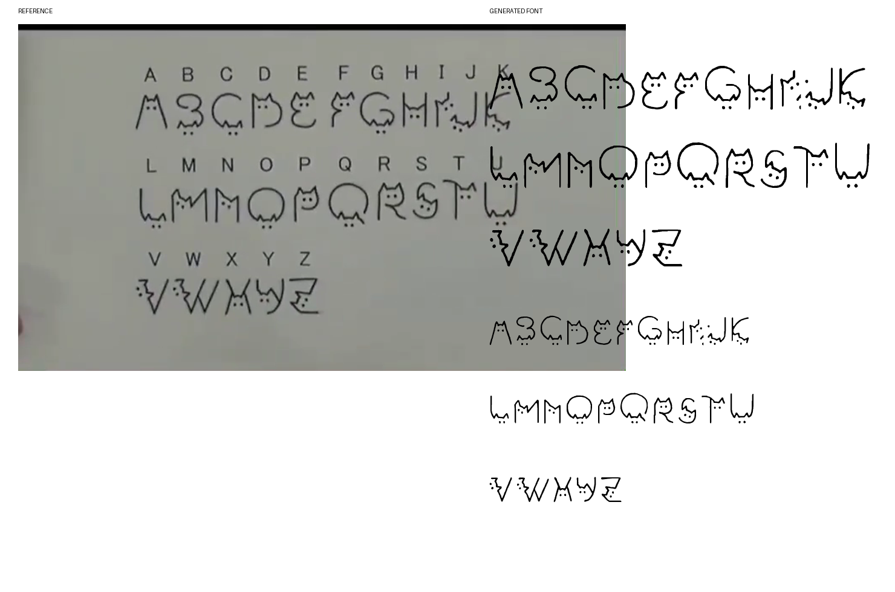
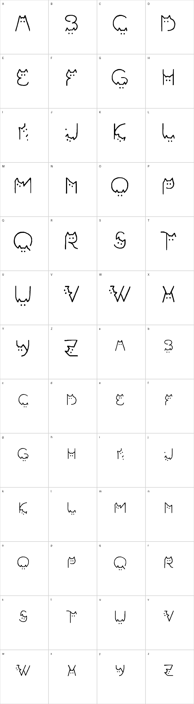

# Cat Font

Cat Font is a playful display typeface built from hand-drawn cat-shaped letters. The uppercase glyphs follow the original cat alphabet reference, and the lowercase glyphs reuse the same shapes at two thirds of the uppercase size.



## Download

- [Download CatFont-Regular.ttf](fonts/CatFont-Regular.ttf)
- [Download ZIP package](CatFont.zip)

## Character Set

- Uppercase English alphabet: `A-Z`
- Lowercase English alphabet: `a-z`
- No numbers
- No punctuation
- Lowercase letters match their uppercase versions at 2/3 scale



## Installation

### Windows

1. Download `CatFont-Regular.ttf`.
2. Open the file.
3. Click `Install` or `Install for all users`.

If Windows still shows an older version, uninstall the previous `Cat Font` or `Kocia Czcionka` entry from Windows Fonts, then install the new file again.

### Linux

```bash
mkdir -p ~/.local/share/fonts
cp CatFont-Regular.ttf ~/.local/share/fonts/
fc-cache -f
```

### Android

Android font installation depends on the device manufacturer. The safest option is to import `CatFont-Regular.ttf` directly into an app that supports custom fonts, such as a design, drawing, note, or video-editing app.

## Files

- `fonts/CatFont-Regular.ttf` - installable TrueType font
- `CatFont.zip` - packaged download
- `screenshots/catfont-preview.png` - visual comparison preview
- `screenshots/catfont-glyph-map.png` - full glyph map
- `build_cat_font.py` - generation script

## License

Released under the SIL Open Font License 1.1. See [OFL.txt](OFL.txt).
